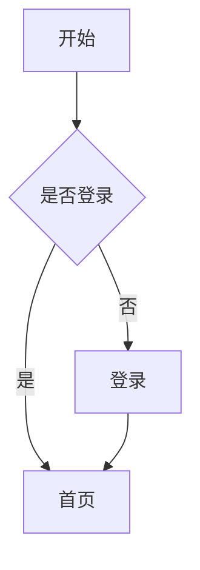
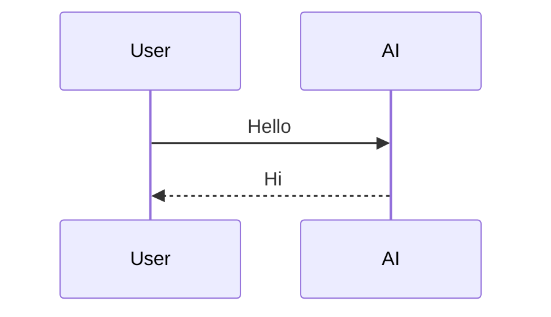

# Markdown 测试文档

> 用于测试 AI Chat、Markdown 渲染器、流式输出、代码高亮等功能。

---

# H1 标题

## H2 标题

### H3 标题

#### H4 标题

##### H5 标题

###### H6 标题

---

## 文本样式

普通文本

**粗体**

*斜体*

***粗斜体***

~~删除线~~

<u>HTML 下划线</u>

==高亮（部分解析器支持）==

---

## 引用

> 一级引用
>
> 第二行
>
>> 二级引用
>>
>>> 三级引用

---

## 无序列表

- Vue
- React
- Lit
  - 子项1
  - 子项2
    - 子子项

---

## 有序列表

1. 第一项
2. 第二项
3. 第三项

---

## 任务列表

- [x] 已完成
- [ ] 未完成
- [x] 支持 Markdown
- [ ] 支持 Mermaid

---

## 分隔线

---

***

___

---

## 行内代码

这是 `const name = "ChatGPT"`。

---

## TypeScript

```ts
interface User {
  id: number;
  name: string;
}

const user: User = {
  id: 1,
  name: "Tom",
};

console.log(user);
```

---

## JavaScript

```javascript
function hello() {
  console.log("Hello World");
}

hello();
```

---

## Vue

```vue
<template>
  <button @click="count++">
    {{ count }}
  </button>
</template>

<script setup lang="ts">
import { ref } from "vue";

const count = ref(0);
</script>

<style scoped>
button {
  color: red;
}
</style>
```

---

## React

```tsx
import { useState } from "react";

export default function App() {
  const [count, setCount] = useState(0);

  return (
    <button onClick={() => setCount(count + 1)}>
      {count}
    </button>
  );
}
```

---

## HTML

```html
<div class="container">
    <h1>Hello</h1>
</div>
```

---

## CSS

```css
.container {
    display: flex;
    justify-content: center;
    align-items: center;
}
```

---

## JSON

```json
{
  "name": "ChatGPT",
  "age": 2,
  "skills": [
    "Markdown",
    "TypeScript",
    "AI"
  ]
}
```

---

## Bash

```bash
npm install

npm run dev

git status

git add .

git commit -m "init"
```

---

## SQL

```sql
SELECT *
FROM user
WHERE age > 18
ORDER BY create_time DESC;
```

---

## YAML

```yaml
server:
  port: 3000

database:
  host: localhost
  username: root
```

---

## XML

```xml
<user>
    <id>1</id>
    <name>Tom</name>
</user>
```

---

## Python

```python
def hello():
    print("Hello World")

hello()
```

---

## Go

```go
package main

import "fmt"

func main() {
    fmt.Println("Hello")
}
```

---

## Rust

```rust
fn main() {
    println!("Hello");
}
```

---

## 表格

| 姓名 | 年龄 | 城市 |
| ---- | ---- | ---- |
| 张三 | 20   | 北京 |
| 李四 | 25   | 上海 |
| 王五 | 18   | 深圳 |

---

## 对齐表格

| 左对齐 | 居中  | 右对齐 |
| :----- | :---: | -----: |
| A      |   B   |      C |
| 1      |   2   |      3 |

---

## 链接

OpenAI

https://openai.com

[OpenAI 官网](https://openai.com)

[GitHub](https://github.com)

---

## 图片


---

## Emoji

😀 😄 😁 😂 🤣 😊 😍 😎

👍 👎 ❤️ 🎉 🚀 🔥 ✨

---

## HTML 标签

<details>

<summary>点击展开</summary>

这里是隐藏内容。

</details>

<br>

<kbd>Ctrl</kbd> + <kbd>C</kbd>

<mark>HTML 高亮</mark>

---

## 数学公式（KaTeX）

行内公式：

$E=mc^2$

块级公式：

$$
\int_0^1 x^2dx=\frac13
$$

矩阵：

$$
\begin{bmatrix}
1 & 2\\
3 & 4
\end{bmatrix}
$$

---

## Mermaid



---

## 流程图2



---

## 超长代码（测试横向滚动）

```ts
const veryLongVariableName = "abcdefghijklmnopqrstuvwxyzABCDEFGHIJKLMNOPQRSTUVWXYZ1234567890abcdefghijklmnopqrstuvwxyzABCDEFGHIJKLMNOPQRSTUVWXYZ1234567890abcdefghijklmnopqrstuvwxyzABCDEFGHIJKLMNOPQRSTUVWXYZ";
```

---

## 长文本（测试自动换行）

Lorem ipsum dolor sit amet, consectetur adipiscing elit. Vestibulum interdum, erat at pellentesque pretium, metus erat gravida risus, sed vulputate sapien elit sed est. Suspendisse potenti. Pellentesque habitant morbi tristique senectus et netus et malesuada fames ac turpis egestas.

Lorem ipsum dolor sit amet, consectetur adipiscing elit. Vestibulum interdum, erat at pellentesque pretium, metus erat gravida risus, sed vulputate sapien elit sed est. Suspendisse potenti. Pellentesque habitant morbi tristique senectus et netus et malesuada fames ac turpis egestas.

Lorem ipsum dolor sit amet, consectetur adipiscing elit. Vestibulum interdum, erat at pellentesque pretium, metus erat gravida risus, sed vulputate sapien elit sed est. Suspendisse potenti. Pellentesque habitant morbi tristique senectus et netus et malesuada fames ac turpis egestas.

---

## 转义字符

\*不是斜体\*

\`不是代码\`

\#不是标题

---

## 混合内容

> AI 回复通常会这样：

1. 首先分析问题。
2. 给出解决方案。
3. 提供代码。

```ts
const answer = "Hello Markdown";
console.log(answer);
```